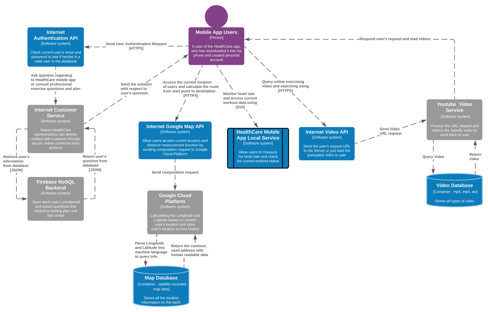

# CYBR8480 Semester Project
A semester project regarding to healthy care records and instructions along with customer support service.

## Overview

* [Executive Project Summary](#executive-project-summary) - What are you doing and why?
* [Requirements Analysis](#requirements-analysis) - What does your app/product do and who does it serve?
* [Design](#design) - How is the app going to be designed?
  - Draw an architecture diagram of your proposed app
  - Identify significant design challenges
* [Security Analysis](#security-analysis) - Analyze your design and augment it to address weakenesses 
  - Analyze your design for security vulnerabilities
  - Augment your design with security features to address vulnerabilities
* [Implementation](#implementation) - Build your app
* [Testing](#testing) - Develop and execute a testing plan
* [Demo](#demo) -  Show off your app and discuss your security tests in a presentation video
* [Packaging and Release](#packaging-and-release) - Document your project


### Project Name
HealthCare app makes us better

#### Executive Summary - Problem statement text goes here

Thanks for technology, the contemporary people's life become very convenient and efficient. More Specifically, electronics can help them experience variety of services without leaving their houses. Such as, ordering foods, online shopping, finding jobs, remote working, facetimes with others are living in different countries, or electronic business. However, with relying on those technologies, people's health is gradually decreasing in a rapid way. Due to lack of exercise, all kinds of diseases jump into people life. Therefore, in this project, I would like to develop a kind of exercise reward body healthy app to help people increase their health condition and raise attention on the importance of workout. Additionally, we are still providing the customer support service to help our user while they encounter with any other problems. If it possible, I would like to embed with a payment function into the app and provide some bonus mechanism (cash, giftcard, and coupon) which can be used for inspiring people's interest on using my app while they would like to do the exercise. 

#### Project Goals
* **User authentication mechanism:** We will provide an app user interface to allow our user to interact with our customer service. The privacy is guaranteed because every user can only access his own comments and our support service responses. In other words, individual users’ comment will not be exposed to everyone in our system.  
* **Heart rate measurement:** To measure user's heart rate, our users don't need to purchase any other peripheral to test their heart rate after or before workout. Hence, it saves users expenditure. More speciffically, we use the image processing technique to detect the user's pulse by taking advantages from phone's camera.
* **Video guide of exercise procedures:** Which is a video list to let user access their perfered video demo to refer while they have no idea how to do the exercise. Also, this video guide page can let user search specific video to fit in his/her perference even through that are not related to exercises. 
* **Route calculator:** This will be used while user would like to do the outdoor execise like jogging, biking, or hiking. Our app will offer a trail calculator to help user realized what the distance he/she will spend on outdoor exercising and the movement route which can help him/her check if it satify their daily workout plan.   
* **Workout recorder:** It works as a memrandum to record all the users' working out status. Such as, it will show a walking steps panel, a calories statistic data, execrising time, and instant heart rate. In addition, it gives instruction to suggest user about how many cups of water ought to drink based on analyzing user's current working out rate.   

## User stories 1

As a busy employee who has to extra work after the normal working time, I want increase my health condition by watching some professional video of indoor execises with lower cost and spend less time, so that I will not stay in the suboptimal health condition or even protect myself from diseases.  

**Acceptance Criteria:**
* A busy employee uses HealthCare mobile app to do indoor workout  
  * “Given I’m a busy employee who doesn't have time to find personal trainer to teach him/her about how to do indoor exercise, and I download the HealthCare mobile app. When     I open the HealthCare mobile app on my phone, and I am able to find some short indoor exercise videos that are recorded by professional coach. Then, I can spend less time     on workout to stay healthy."  

## User stories 2

As a fitness fanatic, I want to measure my heart rate after I have done intensive exercise in the gym without using a wearable detector, so that I will not working out too hard to cause me drained or injury.

**Acceptance Criteria:**
* A fitness fanatic uses HealthCare mobile app to measure heart rate after exercising, in case higher heart rate causes drained or injury. 
  * “Given I’m a fitness fanatic who likes to do intensive execise, and I download the HealthCare mobile app. When I have working out for a while, I can place my fingers on my     phone's camera and test my heart rate without wearing any physical detector. Then, I can decide if I need to do more exercise or not, so I don't get drained or injury."  

## User stories 3

As a cycling enthusiast, I want to calculate the mileage between two different locations and also know my current location at any time, so that I won't lose my way and get wrong direction to bicycle.

**Acceptance Criteria:**
* A cycling enthusiast uses HealthCare mobile app to get his/her current location on the earth and calculate the total cycling distance between the current position and final   destination, so he/she won't lose the direction.  
  * “Given I’m a cycling enthusiast who likes to do long distance cycling, and I download the HealthCare mobile app. When I want to bicycle and haven't decide the destination     because I don't know how far I will do the cycling, I can open the HealthCare mobile app to get my current location and type in different destination addresses to select a     better direction to go with. Then, I will know how far I need to do cycling from my current address without losing my way."  


## Misuser stories 1 
As a network eavesdropper who has experience on doing packets sniffing, I want to using some external tool to sniff user's personal information from HealthCare mobile app, so that I can use those users' info to blackmail them.

**Mitigations:**
* Instead of using insecure communication between mobile app and database, I will use a most developed backend like Firebase with NoSQL and Google Cloud Platform API. Hence,     the HealthCare mobile app's data will become very difficult to capture.
* The HealthCare app will not collect the actual user's information except the name and email address during register phase. To be honest, when the user is asked to input        his/her name, we are not reconmend to put the user's real name into our system. In this case, even though eavesdropper can get the user's email, he/she doesn't know the        real name which can correspond with the email, so it increases the difficulty of blackmailing.  

## Misuser stories 2 
As a internet hacker who is a member in the dark web, I want to collect all of the user's health records and location information from HealthCare mobile app, so that I can sell those information to someone who would like to pay me in the dark web.

**Mitigations:**
* This HealthCare mobile app is actually access the users' location and some health records, but we purposely store personal inforamtion locally. In other words, all of the     information is not traveling through the internet, and only the person who has access to the actual phone can get those records.


## Design - High Level Design


**If you would like acess the larger view of the image, please click [this link to HealthCare Design](./assets/design_2.png), or you can click the top image then check the "raw" resource.**

## Component List
### 1. Authentication Component
User authentication mechanism will be provided while our customer wants to contact question services. It is using the Firebase Backend-as-a-Service (Baas) to process user's credential authorization. Individual can only access his/her own messages along with those response from customer support, so the privacy will be guaranteed.

#### Sub-component 1.1 User Login
Each existed user in the backend has to log in before they can directly send and check the commincating message between himseld/herseld with our client service. We are using HTTPS protocol to build the connection, and user's login is not complicated. Just provide their email address and personal chosen password (which should at least 6 characters).

#### Sub-component 1.2 User Register
If there is a new user that the backend has not stored his/her information, the mobile app will prompt this user to do a simple registration with nickname, email, and password.

#### Sub-component 1.2 Cloud Firestone
It is a database which is using JSON format or some secure ways to store all the user's credentials along with their questions. Every user's personal information will be managed by Google instead of the mobile app.  


### 2. Mobile Local Features
An user health record demo page will be provided. It is running localy and recording all kind of workout related data of the user. Such as, how many steps he/she has walked along with the consumption of calories. Additionally there is a timer to calculate how long does the user spend on exercising

#### Sub-component 2.1 name here
The hydration tracker has also been embedded in the local features. Users can put their daily dose of water ingestion into the app, so the app will help them to remember how many cups of water they have drunk in case dehydration  

#### Sub-component 2.2 name here
Heart rate detector has been designed for those users who would not like to wear a kind of senser to measure their heart rate. This local function is mainly taking advantage from camera image processing technology to detect users' heart rate. Just put two fingers under phones camera while running HealthCare app, users will know their current heart beat after working out. 

### 3. Google Map Service
Google Map services is using the Google Cloud Platform as the backend to interact with HealthCare app. The HealthCare app will use a secure API to access Google's services like Map Direction, Map iOS, and Map Android. Users' data will protected by the security structure of Google.

#### Sub-component 1.1 name here
The HealthCare location tracker will access user's current location, since it is mainly designing for those users who like to hiking and bicycling. Thus, they will not lost their direction and can also realize if they have gone too far from their home. All those data will be processed by Google, so HealthCare will not collect any information from users.

#### Sub-component 1.2 name here
Distance measure function is very useful to give the general idea for those users who are always running or cycling too far away because it helps users calculate the total kilometers between two locations. Furthermore, it can shows the most fast path between two places, so users can bypass the heavy traffic while execising.  

### 3. Video Accessing Service
HealthCare ought to provide some video demo to those users who would like to do the indoor execising or have no idea how to do some less workflow workout. Users can adjust the vplay speed of video and full screen it. 

#### Sub-component 1.1 name here
Searching other video is useful if users have their preference to watch or favorite youtuber trainer to follow, but they have to know the exact video id or link. This is a concern for users' privacy because HealthCare app will not use plain text to retrieve video from youtube, so it will not expose users' behaviours.

#### Sub-component 1.2 name here
Default video list is necessary, since some user's might not want to do some search on watch exercise demo. Therefore, HealthCare provides some basic workout video or even live channel, so users' could just warm up themselves and practice with those workout channels. 


## Security analysis
The misuse case and its remedation of HealthCare app is mainly discussing the security level while hackers would like to do several attacks to get unauthorized access or escalate his privilege to retrieve user's location and login credentials.   


| Component name | Category of vulnerability | Issue Description | Mitigation |
|----------------|---------------------------|-------------------|------------|
| Unauthorized Login | Denial of Service | Without credential validating, anyone can query the server. Hence, this component could cause network paralysis and traffic latency, so that customer support service will not be available | Requiring of registration with user identity and password will restrict bad bahaviours because the malicious user will expose themselves |
| Password Crack | Information Disclosure | Weak password length and complexity will make cracking users' accounts in a simple way | Password management policy will set a minimun length and require more complicated combination while users are creating their passcodes |
| Password Sniffing | Information Disclosure | Hacker can captrue the traffic between users and server while they are communicate each other to sniff passcode | The Firebase backend, which is developed by Google, is using secure communication channel and complex encryption algorithm while it builts connection with users. Hence, it makes network capture become harder |
| Inject Script  | Tampering | | |
| Unauthorized Location Access | Privilege Escalation | | |
| Example | Privilege Escalation | This component exposes an interface to integrated webviews that might allow malicious javascript to read and modify protected data on the component that it shouldn't have access it. | Sandboxing techniques should encapsulate access permissions and capabilities for webviews individually to prevent privilege escalation.|

### Grading Criteria
Your security analysis will be graded as follows:

| | Meets expectations (15-12) | Some Issues (11-6) | Does not meet expectations (5-0)|
|---|---|---|---|
| Category and description| Category and description are appropriate and understandable. High level diagram is marked up in away that makes it easy to see where attacks target. | Some descriptions are unclear or missing. | Most or all descriptions are missing or unclear. |
| Coverage and relevance | Identified problems are relevant to the project and cover most the important potential problem areas. | Some coverage or relevance is missing. | Many potential problem areas are not considered |
| Mitigation Quality | Proposed mitigations are reasonable and appropriate | Some mitigations may not be feasible. | Many missing or non-sensical mitigations. |


## Implementation
Implementation has been submitted and please check the /lib/main file in this repo. 

### Submission Materials
You will submit all of your code to GitHub. Code artifacts submitted after the due date will not be considered. Make sure to have all of your code and artifacts committed to your project repository.

### Grading Criteria
Your implementation quality will be assessed by the degree of maturity and the degree of effort you have put into your product. There is no set rubric for this portion of the final milestone, but the instructor will review your code commits, the quality and quantity of functionality in your app, and holistically examine how well your app meets its requirements.

**Total 150 points.**
## Testing
You need to holistically test your app and system. Use unit tests, systems testing methods, and network/protocol analysis as needed to test your system.

### Submission Materials
You will submit a testing plan document that describes what kinds of tests you performed and the results of your tests. This should be in the form of a table that describes your test, the criteria of evaluation you are using, the type of test performed, the results of the tests, and any actions taken to mitigate findings.

### Grading Criteria
TBA.

## Demo
You will be expected to present your project to the class. You should prepare a 15-20 minute presentation that overviews your app and system, describes its requirement and design, demos its use, and overviews the testing you performed on the system.

### Submission Materials
Submit your slides by including them in your github repository. Upload a video to VidGrid and link it on your canvas submission and in the class-wide discussion thread.

### Grading Criteria
You will be graded by a rubric TBA.

**Total 100 points.**

## Packaging and Release
An important part of developing or assessing a product is making the product or results accessible to those that might want to use it or them. This part of the final milestone tasks you with preparing your product and code for release by using relevant deployment strategies and by creating appropriate companion documentation. 

### Submission materials
For this submission, you should
 * Package your code and/or deployment environment for release using [github](https://github.com/). (Optional) you may also use other potential deployment solutions such as Android play store, an APK distribution, [docker](https://www.docker.com/), etc in addition to github. 
 * Create a ```hardware/software requirements``` section in your github repository and list the hardware components, software, and other technology required to make your app work.
 * Create ```installation``` and ```getting started``` instructions using markdown in your repository to detail what an end-user must do to setup and use your product.

### Grading Criteria
| | Meets expectations (9-10) | Some Issues (6-8) | Does not meet expectations (0-5)|
|---|---|---|---|
|Hardware/Software Requirements| Includes a list of hardware and software requirements necessary for the instructions and usage of the product. | N/A | Does not list hardware/software requirements |

| | Meets expectations (40-50) | Some Issues (25-39) | Does not meet expectations (0-24)|
|---|---|---|---|
|Installation Directions| Clear, complete instructions allow the would-be user to install and build your code.|Directions are missing elements, unclear, and/or incomplete. |Many issues with instructions not working or directions are overly incomplete|
|Getting Started Directions|Clear, complete, and concise getting starting directions are provided to show would-be users how to use your app and product.|Getting started directions are not clear. It is not obvious how to use your app/product.|Minimal or no attempt to generate getting started documentation.|

**Total 110 points.**


#### License
<a rel="license" href="http://creativecommons.org/licenses/by-nc-sa/4.0/"></a><br /><span xmlns:dct="http://purl.org/dc/terms/" property="dct:title">CYBER4580 and related works</span> by <a xmlns:cc="http://creativecommons.org/ns#" href="http://faculty.ist.unomaha.edu/mlhale" property="cc:attributionName" rel="cc:attributionURL">Matt Hale</a> are licensed under a <a rel="license" href="http://creativecommons.org/licenses/by-nc-sa/4.0/">Creative Commons Attribution-NonCommercial-ShareAlike 4.0 International License</a>.
